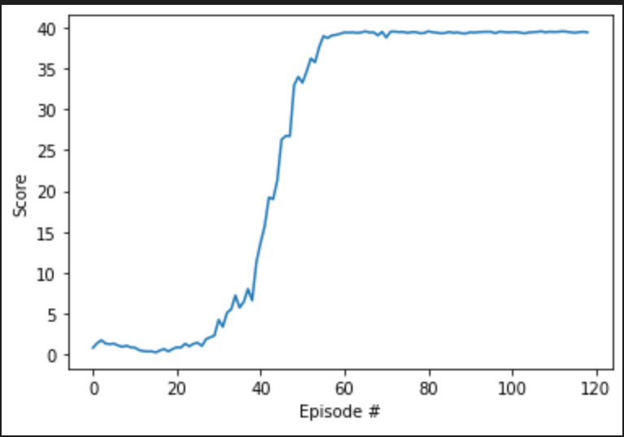

# Project 2: Continuous Control

## Algorithm

The final state of the solution contains the following algorithms:

- Deep Deterministic Policy Gradient
- Experience Replay (Replay Buffer)

The agent logic can be split in:
1. Act/Sample. The agent interacts with the environment. Each experience is stored in an agent memory component.

2. Learn. The agent will use retrieve batches of experience from the memory component in order to learn.

### Worklog / Details

- I started initially with small Actor and Critic networks ( 2 layers, each 32 nodes ), but the agent did not seem to learn in the first 20 episodes.

- I started with the hyperparams from Project 1. Navigation. I played with the hyperparameters (the ones in agent.py), tweaking one by one and seeing impact in learning speed. 

## Hyperparameters

The main hyperparameters:

* *BUFFER_SIZE* - the agent (experience) memory size measured in entries. The value I used is 10^5. I tried higher values, but the agent was much slower.

* *BATCH_SIZE* - the size of a batch extracted from "Memory". I used a size of 128. I did not experiment with many values.

* *GAMMA* - the discount factor, is the discount applied to future events. For this param 0.99 was used.

* *TAU* - the local network parameter contribution ( fraction ) to the target network parameters (set to 0.001)

* *LR* - the learning rate of the networks ( set to 0.0005 )

## Model Architecture

### Baseline model 

The Actor (PolicyNetwork) has a 33 variable input, namely the agent observation space and generates a 4 variable result that represent the actions on the robot arm joints. Internally the actor network has the following structure:

```
(Input 33 nodes) - (256 nodes) - (128 nodes) - (Output 4 nodes)
```

The Critic (ValueNetwork) has a 37 variable input (33 from the agent observation space and 4 from the agent actions) and returns a single value representing the Q value for a specific (state, action) tuple.

```
(Input 37 nodes) - (256 nodes) - (128 nodes) - (Output 1 nodes)
```

### Learning plot



## Conclusion / Future work

* While the steps above improve the agent, a more programatic and organised approach to tweaking hyperparameters and the model would be useful. Most of the tweaking was manual tweaking. 

* Another improvement can be adding the Ornstein-Uhlenbeck process to add some noise to the agent actions. 

* As always another improvement would be to tweak the agent to learn even faster.

* Comparison with other algorithms ([Asynchronous Advantage Actor-Critic](https://arxiv.org/abs/1602.01783), [Generalised Advantage Estimation](https://arxiv.org/abs/1506.02438))